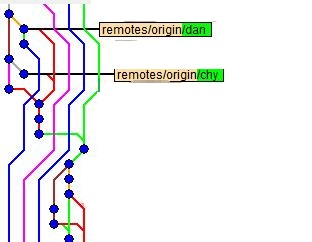

# 第三章(进阶1) 干净的仓库历史
> 阅读资料：[git-recipes: 5.1-代码合并Merge还是Rebase.md](https://github.com/geeeeeeeeek/git-recipes/blob/master/sources/5.1-%E4%BB%A3%E7%A0%81%E5%90%88%E5%B9%B6Merge%E8%BF%98%E6%98%AFRebase.md)

我无意于重复已经存在的教程信息，只准备简单列出本次培训中各位所需要知道的精简信息。
如果你有兴趣，请移步阅读资料中的超链接，更加系统性地进行学习。

要流畅阅读本章，你应该对 [第二章:Git的基本使用](../articles/how_to_use_git.md) 和 [第三章:多人协同开发](../articles/cooperation_with_git.md)有较好的理解。

- 本章你将了解到各种Git工作流，即如何科学地使用Git进行多人协同工作。

- 本章将会讲授一种很容易让萌新感到困惑的操作`git rebase`，如果你暂时无法理解这个内容，请跳过这些内容，在更多的接触Git之后，再回来阅读。

## 保持历史纪录的整洁是非常重要的

在之前的学习中我们了解到`.gitignore`，它可以使你的仓库变得整洁。
之所以这么强调整洁，这是因为基于Git的开发是一个多人环境，复杂、难以理解和重复的非必需内容容易让人感到困惑，进而拖慢整个团队的开发效率。

本小节将会讲到一个重要的指令：`git rebase`(或`git merge --rebase`)。

这是非常容易让萌新感到困惑的内容，目前阶段你需要知道，保持一个干净而整洁的仓库历史记录、消除过多无用的`commit`记录是非常必要的，而上述命令就是用以实现这个需求的方法。你可以暂时跳过本节，待你在更多地接触Git之后，再回来阅读。

---

我们先来说说几条黄金法则：

- **黄金法则①** 过多的无用提交记录将会拖垮整个团队的开发效率。
- **黄金法则②** 永远不要对远程仓库上的分支进行整理，除非团队中有人主导这项工作。而相应的，每个人应该在向远程仓库`push`自己的内容前做好分支整理/仓库历史整理，或是在`pull request`时由他人做好`code review`工作。
- **黄金法则③** 谨慎使用`git rebase`，否则你将丢失大部分仓库历史，一定程度上有可能导致代码的丢失。出于历史记录的可阅读性考虑，引入`pull requese`时请尽量使用`merge`。
- **黄金法则④** 不要对你已推送为远程(公共)分支的本地分支进行`rebase`操作。

## 变基操作

先来说说`git rebase`，也就是变基操作。

什么是**基(base)**？如下图所示，几个分支或几条记录共同的祖先，就叫做"基"：(下图显示的是两个分支的基)

### ① 单分支记录合并(合并多条重复记录)

我们先做几次提交，把仓库历史变成下图左边那样：

执行命令`git rebase -i HEAD~3`(【-i】参数是指互动模式，即可以自己在`Vim`中编辑`reabse`的模式)来准备合并最新的三条记录。这时会进入`Vim`界面，用于写入真正的合并操作，就像上图中部那样`<操作符> <版本ID> <该版本的Commit Message>`。其中，操作符的缩写及意义如下表：

操作符|意义
:-:|:-:
p|使用本次提交作为这个几个合并的新基
r|使用本次提交作为这个几个合并的新基，但重新编辑提交信息(commit message)
e|使用本次提交作为这个几个合并的新基，但不进行修正(即产生一个新的版本ID号)
s|将本次提交合并到上一个基(从下往上看，参考上图的中图)
f|类似`s`操作，但是把它们的提交信息全部放弃
x|使用Shell运行接下来几行的命令(一般用于高级操作，属于大佬秀操作的专属操作符)
d|直接移除该提交

最终的`rebase`效果就如同上图的右图一样。整个流程就像下面这样：

### ② 多分支变基git合并

`rebase`的另外一种操作场景，就是用于分支合并时的历史整理。
当你的项目越来越大，你的仓库历史会出现越来越的的合并操作：

这就非常让人感到困惑，往往搞不清版本是怎么向前推进的。如果能把master这条线捋直该多好！

这时候，`git rebase`就又派上用场了。

**练习**：

1. 新建一个库，新建一个`test.txt`文件，键入内容【master 1】，提交。
2. 创建分支`feature_1`，修改`test.txt`文件，改为内容【feature_1 1】，提交。
3. 新建一个文件`feature_add.txt`，提交。
4. `git checkout master`，修改`text.txt`内容为【master 2】，提交。
5. 新建一个文件`master_add.txt`，提交。此时你的仓库历史应该如下图左侧所示。
6. `git checkout feature_1`，执行`git rebase master`，解决冲突，然后执行`git rebase --continue`完成变基操作。观察工作区内容。此时你的仓库历史应该如下图中侧所示。
7. 使用`git checkout master`，然后向前checkout该分支的版本。此时你的仓库历史应该如下图右侧所示。

你的仓库历史应该会是这样：

整个流程可以用下图所示的样子进行总结：

## 更干净的`merge`

这里会用到两条指令：

- `git merge --sqush` 压缩合并，把要并入的分支上的所有历史并为一个，但可能会丢失部分提交信息(除非在`commit message`中写了Sign off信息)
- `git merge --rebase` 变基合并，保留了所有信息，但把所有的历史接到了base的分支上，就像我们上面利用`git rebase`合并两个分支一样。

在[下一章](../articles/welcome_to_github.md)中，我们会提到什么是`pull request`，到时候你将看到下面这张图：

你会看到这三种合并请求分支(pull request branch)的方式，当你明白你在做什么时，推荐使用`git merge --rebase`来并入这些`pull request`的请求。
但如果你实在拿不定主意，采用"完整合并"总不会是太差的选择。

---

[返回目录](../README.md)