# 第二章 Git的基本使用
> 深入学习的阅读资料：[git-recipes: 4.1 图解 Git 命令](https://github.com/geeeeeeeeek/git-recipes/wiki/4.1-%E5%9B%BE%E8%A7%A3-Git-%E5%91%BD%E4%BB%A4)

我无意于重复已经存在的教程信息，只准备简单列出本次培训中各位所需要知道的精简信息。
如果你有兴趣，请移步阅读资料中的超链接，更加系统性地进行学习。

- 本章你将了解到如何使用Git，主要以Git GUI的使用为主，辅以部分需要Git Bash键入的git指令。完全萌新向和速成向。

- 本章结束后会留有一个小练习。你应当在使用Git GUI完成练习后，移步上面的学习资料了解更多相关的Git指令。

## 第一步：建立一个本地仓库

在[上一章](../articles/git_and_github.md)中，我们利用GUI建立了一个Git本地仓库。

我们回顾一下做法：

1. 随便新建一个文件夹，叫啥不重要，进入文件夹，右键空白处，选择`Git GUI Here`。
2. 选择`Create New Repository`，`Browse`到你新建的文件夹，点击`Creat`建立仓库。

利用GUI建立一个仓库非常简单，但这里我们要稍微涉及一点Git指令，讲一讲如何使用git指令建立一个仓库：

1. 随便新建一个文件夹，叫啥不重要，进入文件夹，右键空白处，选择`Git Bash Here`。(你也可以直接打开`CMD`或者`Powershell`等shell终端，`cd`到这个目录中)。
2. 输入命令`git init`，此时这个仓库一样建立起来了(你应该会看到一个名为`.git`的隐藏文件夹)。

看，实际上Git指令没那么复杂，甚至和GUI一样和善。^_^


---


现在，我们要补充一些关于仓库的知识：

- **本地仓库** 在上文中，当我们使用`git init`创建仓库时，建立的就是一个带**工作目录**的本地Git仓库。因为它存在于你的本地环境中，且并不与任何人直接进行交互。


- **远程仓库** 相对的，放在服务器上的自然就是远程仓库咯。比如Github上新建一个`Repository`，实际上就为你提供了一个远程仓库。


- **共享仓库** 一般来说，远程仓库都是共享仓库，所有开发者与共享仓库进行直接交互，从而达到间接交互的目的。

> 那么如何建立一个共享仓库呢？按照上面的步骤，将输入`git init`改为输入`git init --bare test.git`，你会发现目录下多出了一个名为`test.git`的共享仓库，它并不带有工作目录，假如你的电脑是一台服务器，那么别人就可以通过`your_account@url:port/$PATH/test.git`访问到这个共享。

- **工作目录** 工作目录中的文件收到Git的控制。参考下图中的`代码文件x.xxx`，它们所在的区域就是工作目录。

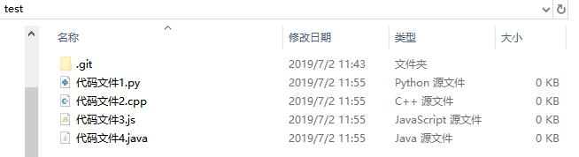

## 第二步：设置你的个性化信息

Git是一个团队开发工作，你对团队的每次贡献都会有相应的记录。所以此时你应该告诉这个仓库你的个人信息，主要包括两个：

- **邮箱** 邮箱是别人联系你的途径，当然你应当留意你的个人隐私问题，这个内容我们会放到之后的几章中讲，此处你可以随便填写一个邮箱。
- **姓名** 你可以填真名或是化名，取决于你的实际开发和协作环境。

让我们先从Git GUI入手：

1. 右键空白处，选择`Git GUI Here`打开你的仓库。
2. 按照下图操作（`Edit`->`Options...`），打开【Git Config】。

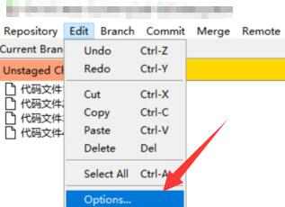

3. 如下图所示，我所建立的这个仓库名为`test`，所以左侧是这个仓库的配置。右侧是全局的配置，“全局配置”的意思是在这个机子中每次建立一个仓库时会默认使用右侧的配置，除非左侧的配置项与右侧的不同。

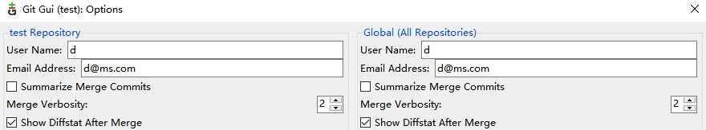

接着我们来学学使用【Git指令】该怎么进行以上操作：

1. 打开Git Bash界面，我们输入指令`git config --help`来查看`git config`的帮助文档。【--help】是一个很有用的指令参数，当你忘了某个指令的使用方法，你都可以如此进行搜寻。
2. 我们可以看到如此一行：


```
user.email
	Your email address to be recorded in any newly created commits. 
	Can be overridden by the GIT_AUTHOR_EMAIL, GIT_COMMITTER_EMAIL, 
	and EMAIL environment variables. See git-commit-tree(1).
```
3. 使用`git config user.email <你的Email>`进行邮箱的设置。同样的，`git config user.name <你的名字或化名>`可以设置该本地仓库的所有者姓名。
   

- 当你设置完这些值之后，可以打开`.gti/config`，查看到你刚刚所设置邮箱和姓名。

> 推荐使用[VS Code](https://code.visualstudio.com/)或[NotePad++](https://notepad-plus-plus.org/)等软件打开文本文件，Windows自带的笔记本实际上是有问题的，会在每个文档的首行不受控地添加一个【0xefbbbf】，导致某些Bug。:(

## 第三步: 工作区与缓冲区

接下来，我们要说说如何真正操作Git完成版本控制。先看下图：

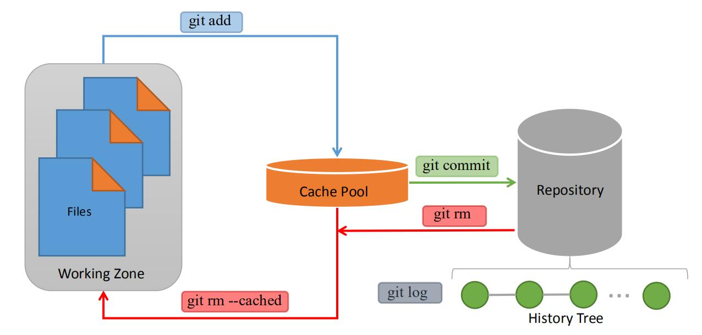

上图是Git的基本工作流程，目前阶段我们需要知道三个区域：**工作区域**、**缓存区**和**仓库记录**。其中，仓库记录是由**历史记录**构成的，因为历史纪录是一棵树状结构，也被叫做(History Tree)。

- 用户在工作区域(或工作目录)中进行的修改会被Git检测到，通过`add`指令被提交到缓存区。
- 缓存区中的文件是工作区域中的文件的一次快照备份，你之后在工作区域中做任何修改都不会影响到缓存区中同一个文件的内容，除非再次使用`add`指令更新缓存区。
- 当你觉得工作做得差不多了，你可以使用`commit`指令，把缓存区中的文件提交到仓库记录，仓库记录会自动生成一次历史记录。你可以简单认为仓库记录就是个数据库，一次`commit`指令就是一次数据库写入请求。从此之后该记录将一直留在仓库中，你也可以把工作区中的数据文件随时回滚到当时提交的这个版本。
- 缓存区中的文件在并未被`commit`之前，并不会被写入记录，也就意味着有些操作会导致你丢失缓存区的文件快照备份(如`checkout`等，我们以后会讲)。

为了配合这张图，我们这次先讲利用Git Bash指令如何进行`add`和`commit`的操作：

1. 在建立的仓库中新建一个txt文本，假设为`test.txt`，里面随便敲入一行字【天气真好！】。
2. 打开Git Bash，键入命令`git add test.txt`。
3. 键入命令`git status`查看缓存区和工作区的状态，你会看到下图的结果，说明test.txt已经被添加到缓存区了：

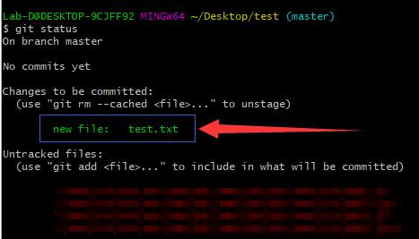

4. 键入命令`git commit`准备提交缓存区的变动到仓库：

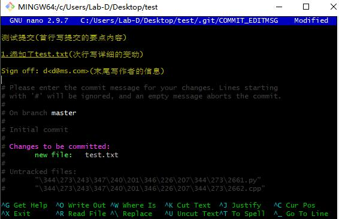

5. 你会看到上图的反人类的`Vim`界面。在Windwos下的Git Bash的操作中，`Vim`的操作已经很和善了，每一次提交需要写一份提交信息，就像图中【黄字】所显示的那样，写作要点我已经用括号列出来了，现在讲讲这个界面如何进行确定、取消等操作。

> 事实上可以通过修改配置文件来使用其它编辑器来编辑commit信息，这部分内容请自行百度

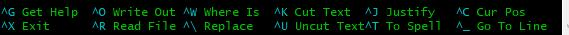

6. 上图中你所看到的就是操作提示。以`^X Exit`为例，这个操作提示告诉了你要使用`Ctrl+X`键来退出。由于退出时会询问你是否保存本次提交，因此此时你按下键盘上的`Ctrl+X`然后再按下`Y`进行确认保存，最后还需要再按下一次`回车键`以最终提交。

## 第四步：提交与历史

此时，你已经完成了一次`commit`提交，`test.txt`文件被写入了仓库记录。

键入`git log`可以显示当前的仓库历史：

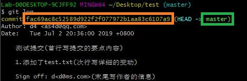

仓库历史中你目前所需要关注的只有两个：橙框和绿框部分。
绿框部分表示发生变动的**分支**，橙框部分是本次历史记录的ID。

---

我们讲完了如何使用Git Bash进行`add`和`commit`操作，接下来说说使用Git GUI该如何做。

1. 我们先编辑一下`test.txt`，改成【天气不好！】。
2. 打开Git GUI：

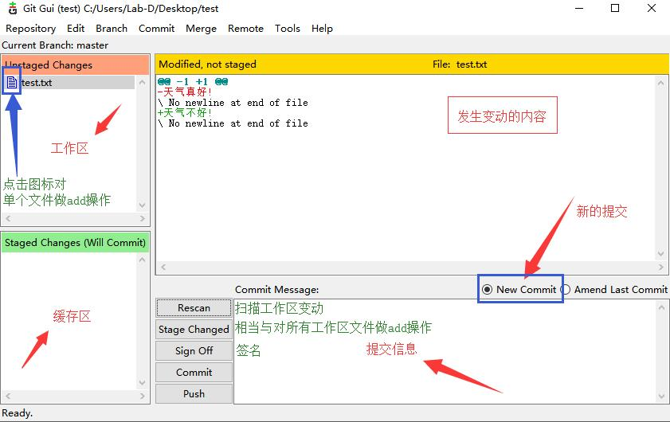

3. 现在，有两种可以完成`add`操作的方法：其一是点击工作区中文件前的图标对单个文件做`add`操作；其二是点击`Stage Changed`按钮直接把工作区所有的文件进行`add`操作。
4. 接下来填写提交信息之后，点击`commit`进行提交操作。

> Σ(っ °Д °;)っ 同样是进行`add`和`commit`的流程，使用Git GUI与使用Git Bash相比，是不是前者更加直观明了？

使用GUI进行历史记录的查看也非常简单，按下图操作即可（`Repository`->`Visualize All Branch History`）:

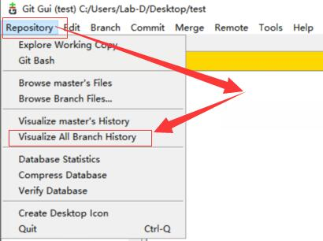


---

现在，我们记得`test.txt`中的文字是【天气不好！】，如果我们要回滚到之前的那个版本，即【天气真好！】，要怎么做呢？

- 打开Git Bash，键入`git log`，找到上一次提交的版本ID值(SHA ID)，键入命令`git checkout 第一次提交的ID值`，此时版本便已回滚到了之前那个版本。
> ID值往往只需要输入前6位即可，如`git checkout fac69a`。
> 
> - `git log --oneline`可以以更简略的方式显示历史记录哦。

## 第五步：推送与拉取

这部分的内容我们将在下一章正式开始讲述，此处仅做一个提纲性的概述。

由于Git是一个分布式版本控制软件，所以在一个系统中除了你机子上的本地仓库(Local)，还存在其他人控制下的仓库，而本地仓库间并不直接进行交互和版本通过，而是通过一个服务器上的远程仓库(Remote)进行协同，这有点像C/S结构的应用的工作方式。

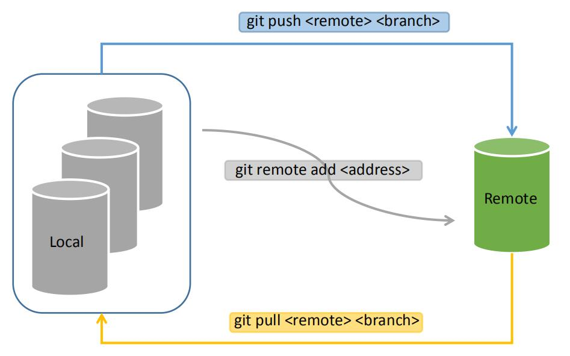

我们将在下一章利用Github作为远程仓库，来进行学习。


## 本章回顾与练习

本章涉及的Git指令有：

1. `git init` 建立仓库
2. `git add <文件名或目录>` 将文件从工作区移动到缓存区
3. `git commit` 将缓存区的文件提交到仓库历史
4. `git log` 查看仓库历史
5. `git checkout <SHA ID>` 回滚版本

**练习**：(Git Bash)或(Git GUI)任选。

1. 新建一个仓库。
2. 在工作区添加一个任意语言的Hello World文件。
3. 将其添加到工作区。
4. 进行一次提交（请提前树立编写commit的习惯）。
5. 修改Hello World文件，添加到缓存区，但不进行提交。
6. 查看仓库历史，回滚到第一次记录的仓库历史。注意观察Git对本次提交的提示和最终的结果。
7. 请回答：你是否已经永久遗失了第二次修改的内容？缓存区为什么没有办法记住第二次修改的内容？
8. 请试试如何使用Git GUI进行版本的回滚。提示：右键点击要回滚的版本，选中`Rest ... to Here`后要记得选择Hard模式哦。(要注意当前的branch不是HEAD，如果是HEAD请`git checkout master`)


## 进阶内容


**想了解如何更优雅的操作工作区？**

- **第二章(进阶1)** [让仓库更干净](../articles/how_to_write_gitignore.md)

**想了解更多对仓库历史记录的操作？**

- **第二章(进阶2)** [世上真有后悔药](../articles/reset_history.md)

**想了解更多关于版本移动和工作区管理的方法？**

- **第二章(进阶3)** [知晓 Stash、Checkout 和 reset 指令](../articles/stash_and_more.md)

---

**想知道有没有比Git GUI更高效的图形化操作软件？**

你可以试着自己去了解一下:[TortoiseGit](https://tortoisegit.org/)，这款软件还有中文语言包可供使用。如果日后还有机会，我会更新部分关于这个软件的使用介绍。

> TortoiseGit provides overlay icons showing the file status, a powerful context menu for Git and much more!

当然，上面提到的“乌龟Git”非常经典，功能也很强大，但是其封装了大量的不常用命令，使得整个操作变的很复杂。因此我还会向你推荐另一款好看又好用的Window免费Git图形界面：[“章鱼”Git:gitkraken](https://www.gitkraken.com/)

---

[返回目录](../README.md)
