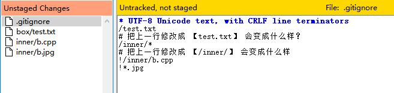
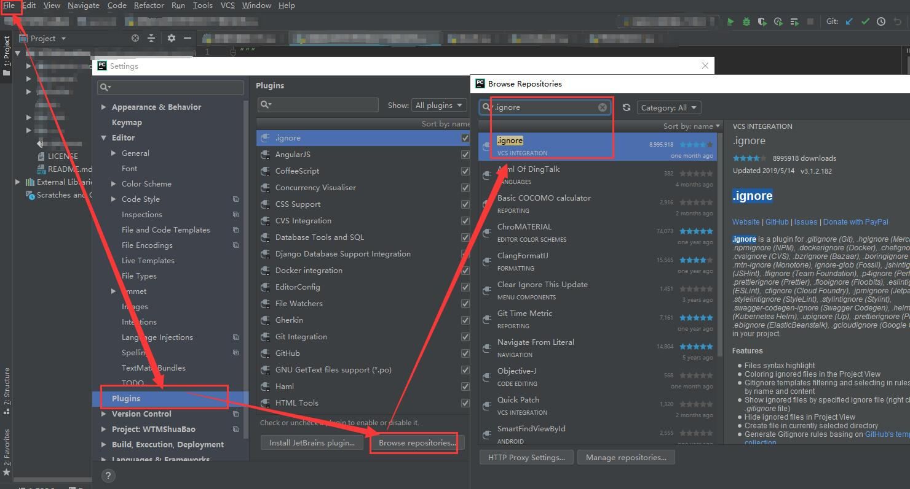
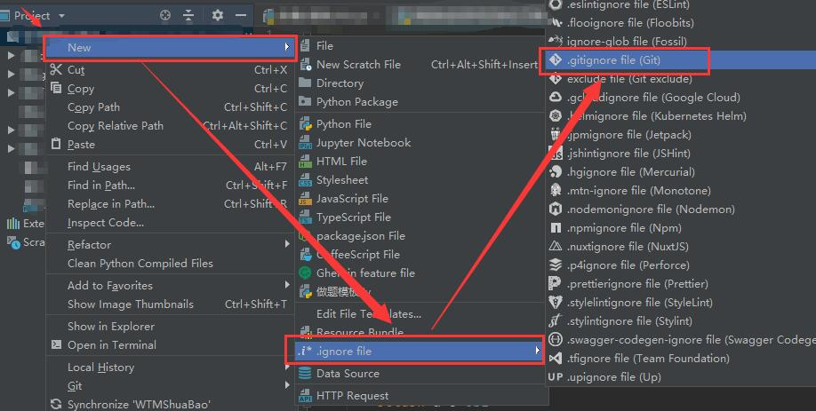

# 第二章(进阶1) 让仓库更干净
> 引用的阅读资料：[[Git]Window下创建.gitignore以及.gitignore的语法](https://blog.csdn.net/Shenpibaipao/article/details/78129342)

我无意于重复已经存在的教程信息，只准备简单列出本次培训中各位所需要知道的精简信息。
如果你有兴趣，请移步阅读资料中的超链接，更加系统性地进行学习。

要流畅阅读本章，你应该对 [第二章:Git的基本使用](../articles/how_to_use_git.md) 有较好的理解。

- 本章你将了解到如何书写一份`.gitignore`文件。

## 什么是`.gitignore`

`.gitignore`文件定义了工作区中不被Git进行版本追踪的文件。

它广泛适用于且不限于以下场景：

- 工作区中存在配置文件，配置文件涉密但又与本地程序的运行密切相关，无法使用`git rm`等命令移出工作区，但我们又不想其进入版本库/仓库历史；
- 一些与项目运行无关的运行时文件，如JAVA编译后产生的`.class`文件等。提交这些文件扩大了仓库的体积，而又毫无意义。
- 与项目相关的依赖，如`Node.js`的`packages.json`所指定的依赖库等；

## `.gitignore`的语法规则

`.gitignore`的语法规则相当简单，它只有六条规则，熟悉正则匹配的同学很快就能记住：

- `*` 多通配符，可以匹配任意长度的字符串，如`*.jpg`可以匹配所有的`jpg`图片文件；
- `?` 单通配符，可以匹配任意一个字符，如`co?.jpg`可以匹配`co1.jpg`、`cox.jpg`等文件；
- `/` 表示目录分隔符。`.gitignore`中的目录地址均采用相对地址；
- `!` 表示反匹配。我们将在下文详细讲解；
- `[]` 类似单匹配符`?`，只不过限定了单字符的范围，如`co[1x].jpg`只可以匹配`co1.jpg`、`cox.jpg`但能匹配`co2.jpg`等文件；
- `#` 表示本行是注释文本。

## Windows下创建`.gitignore`的方法

由于Windows不允许创建以`.`开头的文件，因此我们新建一个文本文件时，需要将其命名为：

- `.gitignore.` (即前后各有一个`.`)

- 同时，`.gitignore`应该放在与仓库的根目录下，即与`.git`文件夹平级。

## 匹配示例及反匹配

```
*/myFiles/*
*.exe
a?d.mat
!*ok.exe
*.py[cod]
/text.txt
do.cpp
```

- 第一行将忽略"myFiles"文件夹内的所有文件，且不限于根目录下的"myFiles"文件夹；
- 第二行将忽略所有".exe"文件；
- 第三行将忽略"a1d.mat"、"afd.mat"、"aOd.mat".....；
- 第四行将保证不忽略所有以"ok.exe"命名结尾的文件，如"abc123Ok.exe"等（优先级高于第一行 和第二行给定的规则，也就是说，如果myFiles文件夹中包含"aOK.exe"，该文件也将不被忽略）；
- 第五行将忽略所有以".pyc"、".pyo"、".pyd"结尾的文件；
- 第六行将忽略仓库根目录下以"text.txt"命名的文件。
- 第七行将忽略仓库所有目录下以"do.cpp"命名的文件。（注意与第六行的规则比较）

## 注意事项

`.gitignore` 无法禁止Git对版本库中已有文件的追踪。即，如果先提交了`test.txt`到了仓库历史，再把`*.txt`加入`.gitignore`是无济于事的。

想要解决这个问题，请参考这篇文章：[世上真有后悔药:撤销版本追踪-.gitignore 与 rm](../articles/reset_history.md)

## 编写练习

1. 创建一个版本库，创建以下文件夹和文件，但不加入缓存区和提交：

- `/test.txt`
- `/box/test.txt`
- `/inner/test.txt`
- `/inner/a.cpp`
- `/inner/b.cpp`
- `/inner/b.jpg`

2. 编写`.gitignore`文件使得Git GUI仅可以扫描到以下文件：



3. 给出我编写的`.gitignore`文件（见下）作为参考答案，同时请思考和尝试里面的两个问题：
 
```
/test.txt
# 把上一行修改成 【test.txt】 会变成什么样？
/inner/*
# 把上一行修改成 【/inner/】 会变成什么样
!/inner/b.cpp
!*.jpg
```

4. 在仓库根目录下创建一个新的文件`a.py`，键入内容【print 'Cyberpunk 2077'】，进行一次提交，然后把`a.py`加入`.gitignore`；
5. 修改`a.py`中的内容为【print 'Shut up and take my money!'】，打开Git GUI进行扫描并观察结果。
6. 看完[这篇文章](../articles/reset_history.md)之后，回来思考如何停止对`a.py`的变更进行追踪。

## 赞美新时代

事实上，你并不总需要编写`.gitignore`文件，大部分时候，[有人已经替你写好了](https://github.com/github/gitignore)你所需要的`.gitignore`。

此外，如果你和我一样，是Jet Brain的忠实用户，我这里推荐一款插件：
点击`File`-`Setting`-`Plugins`-`Browse repositories`-搜索`.ignore`，安装这款插件后重启IDE：



你现在已经可以自由选择要加入的`.gitignore`模板了：



---

[返回目录](../README.md)