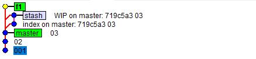
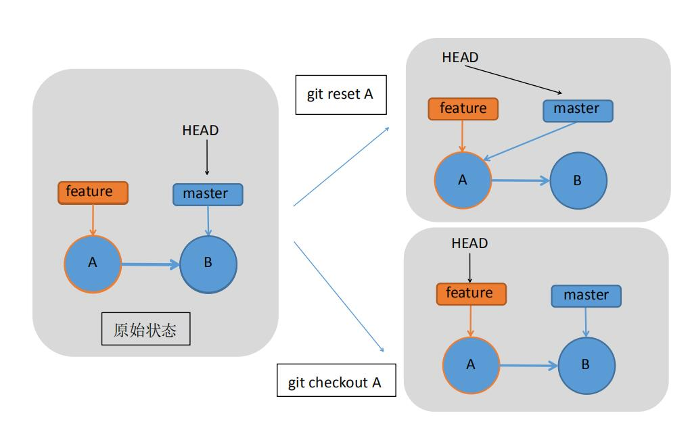

# 第二章(进阶3) [知晓 Stash、Checkout 和 reset 指令]
> 深入学习的阅读资料：[Git-工具-储藏](https://git-scm.com/book/zh/v1/Git-%E5%B7%A5%E5%85%B7-%E5%82%A8%E8%97%8F%EF%BC%88Stashing%EF%BC%89)

我无意于重复已经存在的教程信息，只准备简单列出本次培训中各位所需要知道的精简信息。
如果你有兴趣，请移步阅读资料中的超链接，更加系统性地进行学习。

- 本章你将了解到`stash`指令，了解`checkout`和`reset`的区别。

## 储藏

有时候，你写了一堆代码，想暂时保存、切换到其他分支、切换到其它历史看一眼，但由于工作区尚未保存，你无法切出，可你又暂时不想进行`commit`、污染历史记录。这时，你需要用到`stash`指令。

其实这个知识点非常简单，你只需要知道下面这几个命令：

- `git stash` 保存当前工作区所有内容到当前分支的储藏栈的栈顶(工作区会变为最后一次commit时的内容)。
- `git stash apply` 应用当前分支的储藏栈栈顶的储藏到工作区。
- `git stash apply <stash id>` 应用当前分支的储藏栈指定位置的储藏到工作区，例如`git stash apply stash@{0}`。
- `git stash list` 列出当前分支的储藏栈详细信息。
- `git stash drop <stash id>` 移除当前分支的储藏栈指定位置的储藏。

> 唯一需要注意的是，`git stash apply`并不会改变储藏栈的内容，所以如果你觉得之前的那个储藏没用了，请手动调用`git stash drop <stash id>`清理储藏栈。特别的，`git stash pop`会自动应用当前分支的储藏栈栈顶的储藏到工作区，并将其从栈顶移除。

**练习**

1. 新建一个仓库，建立文件`test.txt`，随意键入一段内容，提交。
2. 创建分支`feature`，修改`test.txt`文件内容，但不提交。尝试使用`git checkout master`指令，看看能否直接切换到`master`分支。
3. 使用指令`git stash`，观察`test.txt`中的内容变化。
4. 使用指令`git stash pop`，观察`test.txt`中的内容变化。
5. 再次使用指令`git stash`，然后尝试`git checkout master`，看看本次能否直接切换到`master`分支。
6. 切换回`feature`分支，应用`git stash pop`，观察`test.txt`文本变化。

```
$ git stash list
stash@{0}: WIP on feature: 661b470 feature分支注释1
stash@{1}: WIP on master: 719c5a3 master分支注释1
```

当你创建了一个储藏，你的历史纪录会如同下图所示：



> 在Git GUI中，`stash`标签标注的是位于栈顶的储藏。

## `checkout` 和 `reset`

在之前的学习中，我们都知道`checkout`和`reset`都能回滚版本，那他们的区别何在呢？

在这里，我们只关心几件事：
- 索引头指针是否变化？
- 分支"长度"是否变化？
- 工作区是否变化？
- 索引是否变化？
- 工作区是否安全？(版本变化前是否检查工作区、防止未保存的内容丢失)

以下图为例，可以清楚观察到二者的区别:



观察上图，显然可以得知：
- `reset` 将移动头索引，一般情况下还会改变Index的内容——即分支"长度"将变化，有可能导致某个提交丢失。
- `checkout` 只改变头指针，并不做任何内容变化。
- 二者的工作区安全属性由下表给出：(【REF】表示该命令移动了HEAD指向的分支引用)

指令 | HEAD变化 | INDEX变化 | 工作目录变化 | 工作区安全？
:-:|:-:|:-:|:-:|:-:
`reset --soft <commit>` | REF | ❌ | ❌ | ✔ |
`reset [--mixed] <commit>` | REF | ✔ | ❌ | ✔ |
`reset --hard <commit>` | REF | ✔ | ✔ | ❌ |
`checkout <commit>` | HEAD | ✔ | ✔ | ✔ |
`reset [<commit>] <file>` | / | ✔ | ❌ | ✔ |
`checkout [<commit>] <file>` | / | ✔ | ✔ | ❌ |

---

[返回目录](../README.md)