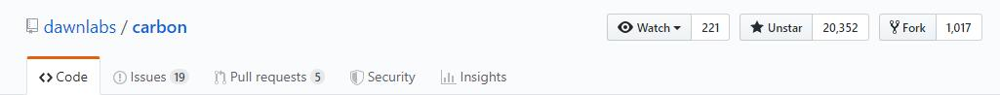
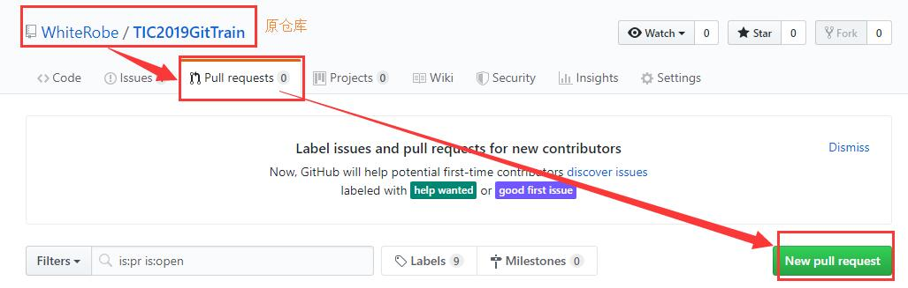
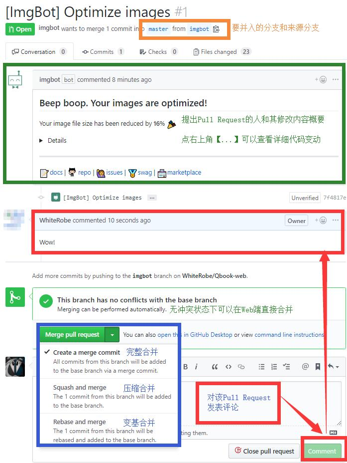
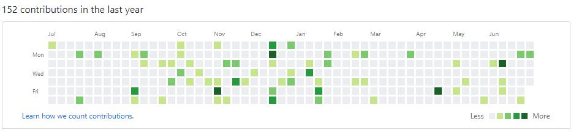
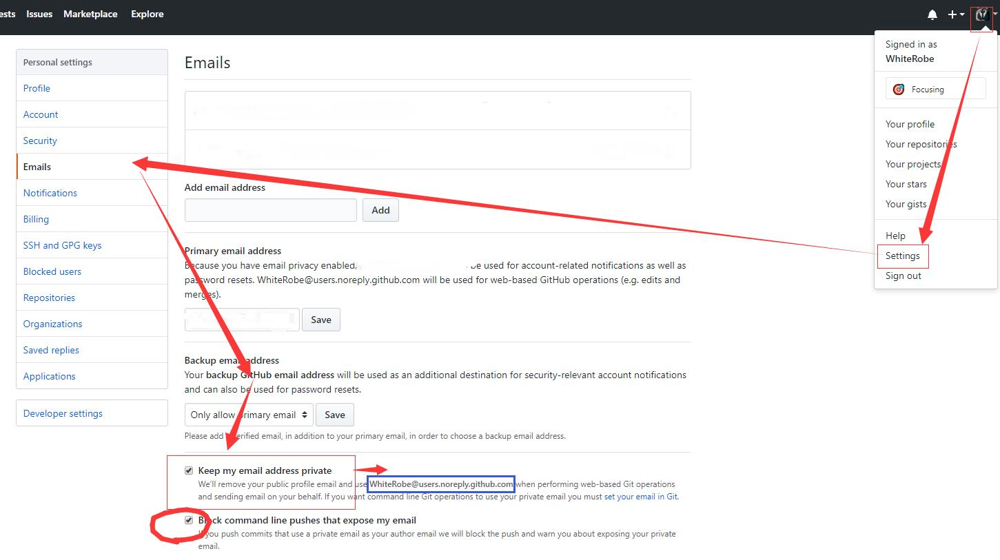

# 第四章 拥抱Github

> 深入学习的阅读资料：[开源指南-中文](https://opensource.guide/zh-cn/)

我无意于重复已经存在的教程信息，只准备简单列出本次培训中各位所需要知道的精简信息。
如果你有兴趣，请移步阅读资料中的超链接，更加系统性地进行学习。

- 看完本章，你将真正意义上开始使用Github，欢迎加入开源社区。

- 关于`pull request`的几个练习请务必进行尝试，体验第一次的开源协作过程。

## Github 好在哪里

- github是世界上最大的开源站点，没有之一！
- 你可以在github发现有趣的项目、发现和你臭味相投的人。
- 你对开源社区的贡献可以建立你的职业口碑，给你的简历添加可供展示的亮点。
- 你可能很难发现你自己写出的Bug。好在，社区会帮助你找到Bug并解决它们。
- 学会团队工作、掌握工程管理技能。
- Github并不只是软件项目的温床，还可以是[书籍](https://github.com/exacity/deeplearningbook-chinese)、食谱、影评甚至是[行为艺术](https://github.com/kelseyhightower/nocode)的记录区。
- 尽管这并不被提倡，但是事实上你可以使用Github作为图床、文件分享库。*(截至目前，Github并不禁止此类行为)*
- 免费！

## 了解开源社区的运行机制

本节将讲述个人对Github所提供的各个功能的理解。

### fork、star 与 watch

**fork**

理论上，一个项目一旦被部署到Github上，他就很难从互联网上消失了——这多亏了`fork`功能。

`fork`操作会把当前仓库完整的复制一份到你的名目下，也就是只要Github的服务器不关闭，你可以随时通过`git clone`获取这些仓库。

这里，我们要学习一个新的指令：

- `git clone <url>` 可以拷贝一个仓库到本地。例如，你可以使用`git clone git@github.com:WhiteRobe/TIC2019GitTrain.git`可以拷贝这篇Git教程到你的电脑里。

一次`fork`行为，其实是在表达以下三种意愿：

1. 收藏代码；
2. 希望站在巨人的肩膀上，继续按你的意愿将这个项目往其它方向发展；
3. 与作者共同参与这个项目的开发、完善这个项目，详见下文的`pull request`。

除此之外，可能有同学会觉得自己账号下的项目太少了，**想fork一些项目来凑数**。这种想法其实是错误的也是毫无意义的，因为你对社区的贡献并不取决于仓库的多少，而在于`Contributions`，我们会在下文提到这些内容。
> ——这也是萌新容易犯的错误，过多无意义的Fork不仅增加了Github服务器的负担，还影响了你对自己仓库的把握。对于某些有精神洁癖的人来说，一个仓库里到处都是`fork`然而毫无贡献的账户，会存在主观意义上的糟糕印象。

**star**

`star`表示的是一种收藏行为，是对Github上你感兴趣的项目进行收藏、方便下次搜寻的操作。他不等同于微博中的"点赞"行为，但你的一个star可能是激励开源作者继续更新的动力。所以如果想支持一个开源项目，不妨点一个star。

**watch**

`watch` 可以让你关注这个库、接收这个库的推送内容或是完全屏蔽这个库。当你觉得这个库极具发展潜力，想要第一时间获得它的动向，不妨点个watch。 

### pull request

前文提到，如果你想共同完善一个Github上的开源项目，你应当先把它`fork`下来，然后`git clone`到本地(注意是`clone`你`fork`后出现在你账户下的分叉仓库而不是原项目)。

当你修正某个bug之后，你再把这些内容推送到你的分叉仓库。
现在，你需要让原仓库的维护者知道你对他的项目进行了改善，你应该提出一个`pull request`:

当你的项目收到一个别人发来的`pull request`，你可以觉得是否对它发来的分支进行`pull`：

如果没有任何冲突，检查他的代码没什么问题后，你可以直接在Web端进行合并(当然你也可以拒绝他的`pull request`)；如果有冲突，你需要如此做：

1. 先进入你的仓库，`checkout` 到别人要合并过来所对应的【你的】远程分支。
2. `git pull`拉取【他的】仓库(要pull过来的分支，如`git pull <url> <branch>`)
3. 解决冲突，推送该合并后的远程分支到你的远程仓库。

> 上图中`merge`的三种方式请参考：[第三章(进阶1):干净的仓库历史](../articles/better_history.md)

---

**练习**

- 由于`pull request`是一个很重要的内容，而萌新刚上手时很难有实质性的代码贡献，所以你们可以`fork`这个仓库，然后向这个仓库提交一次`pull request`，体验这个绝妙的过程。我都会通过你们的`pull request`的。具体做法为：

1. `fork` [这个仓库](https://github.com/WhiteRobe/TIC2019GitTrain)
2. `git clone git@github.com:<你的GithubID>/TIC2019GitTrain.git`把分叉仓库拉取到本地。
3. 在`/practice`文件夹中新建一个文件夹，里面放上一个任意语言写的`Hello World`文件。(如果你不会编程，创建一个`Hello World.txt`文件也行)。
4. `push`这个分支到你的远程仓库，然后按上图所示，向我提交一份`pull request`，我会尽快通过这个流程。
5. （附加）如果你对这些教程有什么更新建议、或者发现了什么错误，也请务必利用`pull request`帮助我修正这些问题、共同完善这篇教程。 o(*￣▽￣*)ブ

### Contributions

**贡献图才是你参与开源项目的收获！**

在Github中，你的每次提交(需要以你在github中所提交的邮箱作为user.email进行提交[才能被记录](https://help.github.com/cn/articles/why-are-my-contributions-not-showing-up-on-my-profile))，都将被列为一次贡献，包括：

- 一次被接受的`pull request`；
- 一次源仓库的`commit`
- 需要注意的是，此类提交需要是仓库的默认分支，才会被记录。

如果你不想暴露你的私人邮箱，你可以在个人设置中隐藏自己的真实邮箱，然后用Github生成的无人问答邮箱作为email，比如我的就是`WhiteRobe@users.noreply.github.com`。

### Issues

- **Issues** 你可以把它认为是一个讨论区，用于讨论一些Bug、对项目的疑问。理论上任何人都可以对某个项目发起讨论，也可以随时关闭这个讨论。

> 有时候，一些很好玩的项目，像是之前的[996.ICU项目](https://github.com/996icu/996.ICU)，最开始就是从`Issues`发酵产生的。
> 
> - 另外，我建议各位使用[`Chrome`浏览器](https://www.google.cn/intl/zh-CN/chrome/)，不然很多有趣的东西都会被某些智商检测浏览器所屏蔽。

## Github的特色你不得不尝：marketplace

[Github插件市场](https://github.com/marketplace)
提供了各种功能库，方便各位进行仓库管理、讨论等功能。

比如我在这里推荐一款插件——[ImgBot](https://github.com/marketplace/imgbot)会监控你的仓库，并对仓库中的图片进行压缩，然后以`pull request`的形式反馈给你。

用过这款插件的都说好，因此，不妨将这个插件作为你上手marketplace的第一个跳板。

**练习:**

1. 在Github上创建一个带有图片的库。
2. 在marketplace中找到这款插件，安装这款插件到这个带有图片的库。
3. 等待ImgBot发来`pull request`。

## 如何完善一个开源项目

一份完善的开源项目，至少应该包含以下几个要点：

1. **项目描述** 方便其它人简要了解该项目的主要作用
2. **READEME** 方便他人详细了解该项目、了解如何使用该项目等，之后会有[专门的章节](../articles/how_to_write_markdown.md)讲述如何编写一份README。
3. **行为规范**([code of product](https://opensource.guide/zh-cn/code-of-conduct/)) 你可以认为这是一份宣言，类似每个医疗工作者就职前都会发表的那种誓言一样。在Github中你可以很简单的构建这样一份`CODE_OF_PRODUCT.md`：`Insights`-`Community`-`Code of conduct-Add`，选中任意一个规范，然后并入的工程。
4. **参与者指南**(CONTRIBUTING)，你可以编写一份`CONTRIBUTING.md`，告诉想要参与这个项目所需要遵守的规范和帮助指南。例如你可以在这个项目中找到这么一份指南：[CONTRIBUTING.md](../.github/CONTRIBUTING.md)
5. **Issues模板** 同样，讨论区模板可以在`Insights`-`Community`-`Issue templates-Add`中进行添加，以告诉其他人该如何参与这个项目的讨论。
6. **LICENSE** [开源协议](https://help.github.com/en/articles/licensing-a-repository#disclaimer)是一个开源项目必不可少的内容，它约定了这个项目的职能范围，是别人决定是否参与、使用你的项目的重要考量。如果你拿不定主意，那么[MIT协议](../LICENSE)至少不会是一个太差的选择。你只需要在仓库的根目录下新建一个名为`LICENSE`的文本文件，然后在里面编写你的协议即可。

## 扩展阅读

**想要知道如何更好地展示你的项目**，你可能需要了解：

- **第四章(进阶1)** [如何书写Markdown/README.md](../articles/how_to_write_markdown.md)

- **第四章(进阶2)** [神奇的GitHub Pages](../articles/github_pages.md)

---

[返回目录](../README.md)
